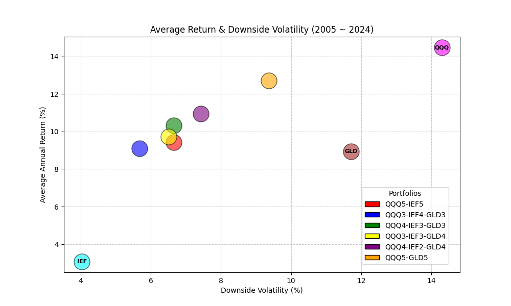
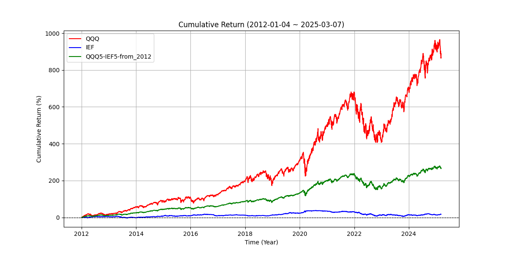

# StockAnalysis
📊 Yahoo Finance 데이터 기반 주식/ETF 분석 및 시각화 스크립트

## Installation
```bash
conda create -n stock_analysis python=3.10
conda activate stock_analysis
pip install -r requirements.txt
```

## Run Analysis
⚠️ 사용할 분석 방식(`--analysis`)은 <strong>Analysis Methods</strong>를 참고해주세요.<br>
⚠️ 수행하고자 하는 분석 방식에 맞는 arguments들을 사용해주세요.<br>
⚠️ Argument에서 `띄어쓰기`가 포함된 내용을 입력할 시, 반드시 따옴표(" or ')로 감싸서 입력하세요.<br>
⚠️ `--ticker`에는 각 분석 방식에 맞는 형식으로 종목코드를 입력해주세요.

### Arguments

| Name             | Type        | Explanation                                        | Required       | Example                        |
|------------------|-------------|----------------------------------------------------|----------------|--------------------------------|
| `--analysis`     | `str`       | 사용할 분석 방식                                    | True           | `avg_return_volatility`        |
| `--tickers`      | `str`       | 분석할 종목 코드(들)                                 | True          | `"SCHD QQQ TLT"`, `"SCHD8QQQ2"` |
| `--save_path`    | `str`       | 저장할 디렉토리 (default: output)                    | False          | `./output`                    |

<br>

```bash
python main.py --analysis <분석 방법> --tickers <종목 코드> --save_path <저장 위치> # 그 외 분석에 필요한 arguments
```

<br>

# Analysis Methods

## 1. Average return and volatility (Annual)
- 특정 종목 혹은 여러 종목들에 대해 (분산)투자하였을 때의 연평균 수익률과 연평균 변동률에 대해 계산
- `--analysis avg_return_volatility`
- `--tickers`에는 개별 종목 혹은 여러 종목들을 `띄어쓰기`로 구분하여 입력 (e.g. `--tickers "SCHD QQQ TLT"`, `--tickers "SCHD"`)
- 각 종목에 대응되는 알파벳을 `--abbrs`로 정의 (중복 X)
- 특정 종목이 들어간 조합(포트폴리오)만을 보고 싶으면 `--must_include` 사용
- 하락 변동성만 확인하고 싶을 때는 `--downward_only` 사용

### Arguments
| Name             | Type        | Explanation                                                  | Required       | Example                 |
|------------------|-------------|--------------------------------------------------------------|----------------|-------------------------|
| `--abbrs`        | `str`       | 각 종목 별 약자(들) (default: S P Q)                          | True           | `"S Q T"`               |
| `--must_include` | `str`       | 조합에 반드시 포함할 종목. None이면 모든 종목. (default: None)  | False          | `"S T"`                 |
| `--downward_only`| `bool`      | 하락 변동률만 계산할지 여부 (default: False)                   | False          | `--downward_only`       |

### Example
```bash
python main.py --analysis "avg_return_volatility" --tickers "SCHD QQQ TLT" --abbrs "S Q T" --downward_only --save_path "./output"
```

### Output


<br>

## 2. Compare average return and volatility (Annual)
- 여러 포트폴리오 별 연평균 수익률과 연평균 변동률에 대해 비교
- `--analysis compare_avg_return_volatility`
- `--tickers`에는 여러 포트폴리오들을 `띄어쓰기`로 구분하여 입력. 포트폴리오는 `{ticker}{ratio}`형태로 비율을 맞춰 작성 <br>
(e.g. `--tickers "QQQ5IEF5 QQQ4IEF3GLD3"`)
- 하락 변동성만 확인하고 싶을 때는 `--downward_only` 사용

### Arguments
| Name             | Type        | Explanation                                                  | Required       | Example                 |
|------------------|-------------|--------------------------------------------------------------|----------------|-------------------------|
| `--downward_only`| `bool`      | 하락 변동률만 계산할지 여부 (default: False)                   | False          | `--downward_only`       |

### Example
```bash
python main.py --analysis "compare_avg_return_volatility" --tickers "QQQ5IEF5 QQQ3IEF4GLD3 QQQ4IEF3GLD3 QQQ3IEF3GLD4 QQQ4IEF2GLD4 QQQ5GLD5" --downward_only --save_path "./output"
```

### Output


<br>

## 3. Long-term Investment Effect
- 각 종목 별로 장기 투자 기간에 따라 연평균 수익률 분포의 변동을 계산
- `--analysis long_term_investment`
- `--tickers`에는 반드시 1개의 종목만 입력. 특정 포트폴리오에 대해 분석하고자 한다면 종목명과 비율을 붙여서 입력 (e.g.`SCHD2QQQ3SPY5`)

### Arguments
| Name             | Type        | Explanation                                                  | Required       | Example                 |
|------------------|-------------|--------------------------------------------------------------|----------------|-------------------------|
| `--min_year`     | `int`       | 최소 장기투자 기간 (default: 2)                               | False           | `"1"`                  |
| `--max_year`     | `int`       | 최대 장기투자 기간 (default: 10)                              | False           | `"5"`                  |
| `--interval`     | `int`       | min~max year 사이에서 분석할 주기(steps) (default: 2)          | False          | `"1"`                  |
| `--num_samples`  | `int`       | 샘플링 할 개수 (default: 500)                                 | False          | `"1000"`                |

### Example
```bash
python main.py --analysis "long_term_investment" --tickers "QQQ" --save_path "./output"
```

### Output


<br>

## 4. Cummulative Return
- 각 종목 혹은 포트폴리오에 따른 누적 수익률 계산
- `--analysis cummulative_return`
- `--tickers`에는 반드시 1개의 종목만 입력. 특정 포트폴리오에 대해 분석하고자 한다면 종목명과 비율을 붙여서 입력 (e.g.`SCHD2QQQ3SPY5`)

### Arguments
| Name             | Type        | Explanation                                                  | Required       | Example                 |
|------------------|-------------|--------------------------------------------------------------|----------------|-------------------------|
| `--start_year`   | `int`       | 시작 연도. 미 입력시 최대치로 설정. (default: None)            | False          | `2012"`                |

### Example
```bash
python main.py --analysis "cummulative_return" --tickers "QQQ5IEF5" --start_year 2012 --save_path "./output"
```

### Output


<br>